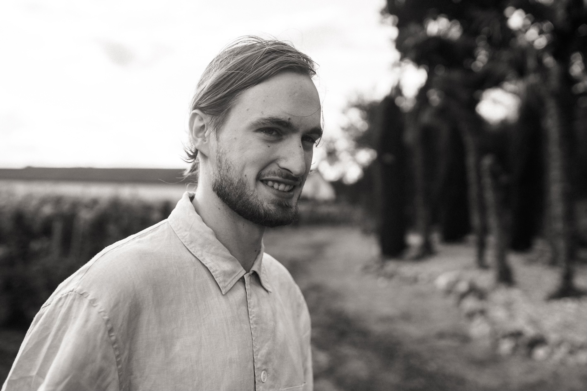

# 👋 Hi, I'm Samuel Buhan

  

    
<strong>Samuel Buhan</strong> is a software engineer with <strong>7 years of experience</strong> in embedded systems development.

    
He specializes in <strong>C, C++ and Python</strong>, building reliable firmware and connectivity solutions for IoT, medical, AI, and aerospace projects.

    
His work focuses on creating maintainable, high-performance embedded software — from low-level drivers to secure cloud communication — while following rigorous engineering practices.

    
Currently based in <strong>Boston (MA)</strong>, he’s passionate about developing robust embedded platforms and exploring next-generation connectivity and automation technologies.

  

  

    
  

  

      <a href="assets/resume_software_engineer.pdf" class="button" style="display: inline-block; padding: 10px 20px; background-color: green; color: black; text-decoration: none; border-radius: 5px;" download>📄 Download my Resume</a>
  

  

  

---

## Technical Skills

**Programming Languages:**  
- C
- C++
- Python
- Assembler
- Java
- VHDL

**Embedded Platforms & Microcontrollers:**  
- ARM (Cortex-M)
- STM32
- Microchip PIC
- Nordic nRF
- Raspberry Pi
- Analog Devices Blackfin
- FPGA

**Communication Protocols & Interfaces:**  
- I2C
- SPI
- UART / USART
- USB
- GPIO
- RS232 / RS485
- CAN
- BLE
- MQTT

**Operating Systems & RTOS:**  
- Linux (Embedded & Desktop)
- FreeRTOS
- Micrium OS
- VxWorks

**Tools & Development Environments:**  
- AWS IoT
- Git
- GitHub
- GitLab
- CI-CD
- Docker
- Bash
- STM32CubeIDE
- Logic Analyzers
- Oscilloscope
- PostgreSQL
- Protocol Sniffers

**AI & Computer Vision:**  
- TensorFlow
- OpenCV
- CNN optimization for embedded platforms
- YOLOv3

**Libraries & Frameworks:**  
- AWS SDK
- Qt (HMI / GUI)
- Pandas
- Streamlit

**Languages:**  
- French (Native)
- English (Bilingual)
- German (Conversational)
- Italian (Conversational)
- Spanish (Conversational)

---

## 💼 Professional Experience

**Embedded Software Engineer (Consultant)** – France  |  *Dec 2024 – Present*  
- Integrated a **4G LTE modem** for industrial IoT devices to improve field reliability.  
- Built a **Python testing tool** to validate modem communication.  
- Implemented **UART communication** using the nRF SDK and FreeRTOS.  
- Established secure **MQTT links to AWS IoT Core** with device authentication.  
- Designed a **network-switching algorithm** to select optimal coverage between carriers.  
- Delivered a complete **embedded-to-cloud pipeline** via AWS Kinesis and Lambda.

**Embedded Software Engineer – Syntony GNSS** | Toulouse, France  |  *May 2022 – Dec 2024*  
- Led architecture, debugging, and validation of an **Android app**, achieving public release.  
- Built a **CI/CD pipeline** for automated Android builds.  
- Created a **Qt communication protocol** reducing installation time by 2 days.  
- Developed a **daemon service** integrating GNSS corrections via Ublox M8T.  
- Built **Python tools for precision error analysis** and deployment support using Docker & Streamlit.  

**Embedded Systems Research Engineer – CNRS** | Bordeaux, France  |  *Mar 2021 – Apr 2022*  
- Led development of an **electronic bracelet prototype** for amputee research trials.  
- Implemented communication with IMU and Bluetooth modules, optimized filtering, and developed battery-management software.  
- Worked extensively with **ADC, I2C, SPI, UART, USB, RS485**, and STM32 BSP.  

**Embedded C++ Engineer – NeoTec Vision** | Pacé, France  |  *May 2020 – Nov 2020*  
- Ported **CNN-based object detection** to an embedded Raspberry Pi-like board for hornet detection.  
- Cross-compiled **OpenCV and TensorFlow** for embedded Linux to enable real-time AI inference.  

**Software Engineer Intern – IRISA / CNRS** | Lannion, France  |  *Jun 2019 – Aug 2019*  
- Studied YOLOv3 behavior and adapted AI processing for constrained DSP hardware.  

---

## 🎓 Education

**M.Sc. in Electronics & Computer Science** – ENSSAT (Lannion, France)  
**M.Sc. Exchange in Embedded Systems** – UQÀM (Montréal, Canada)

<a href="education.md"> Learn more</a>

## Contact Me

- [<i class="fab fa-linkedin"></i> LinkedIn](https://www.linkedin.com/in/samuel-buhan-798529175)
- [<i class="fa fa-envelope"></i> Email](mailto:samuelbuhan@gmail.com)